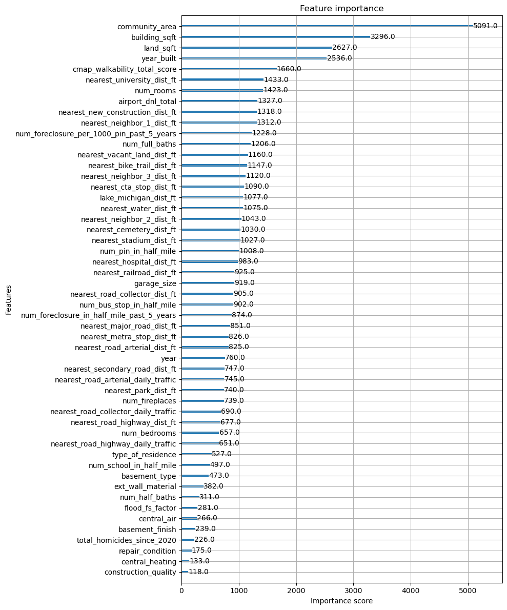
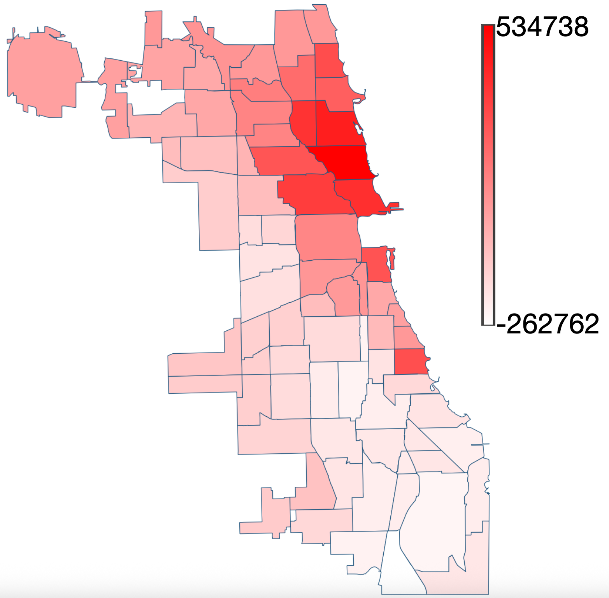
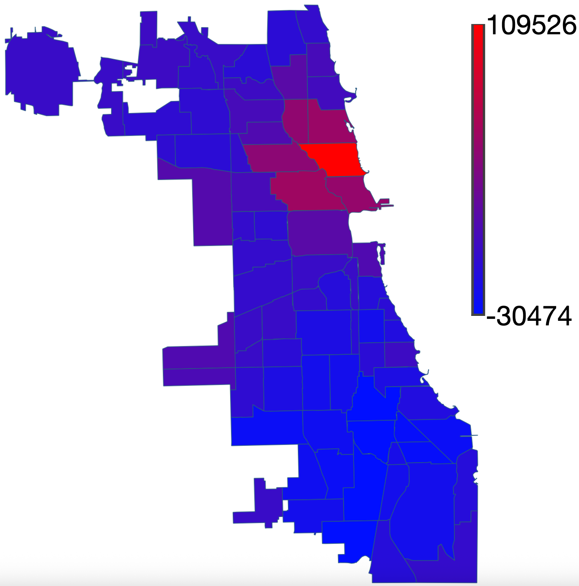

# summer26-chicago-neighborhood-premium-2
Team project: summer26-chicago-neighborhood-premium
This repository contains a project for the Summer 2026 Erdős Institute Data Science program. 
## Overview
Like many major cities, Chicago is comprised of many smaller neighborhoods each with its own culture and attractions. There are 77 officially recognized neighborhoods in Chicago, and even neighborhhods which are very close geographically such as Kenwood and Washington Heights can be readically different. The goal of this project is to get a measure of the premium homebuyers pay in order to get a home in each of the neighborhoods. We focused on single family homes, and since there are few of these in the Loop neighborhood of Chicago we did not include this neighborhood. This is both a measure of how much contractors can expect to gain/lose by building in a specific neighborhood as well as an indicator of the benifits of living in each neighborhood not captured by our list of features.

For our final model, we used the XGBoost gradient boosted tree classifier to get a predicted price of a single family home using several variables, one of which is the community area. We then computed the partial dependency function for this model for each of the community areas. The premium payed to buy in each area is then taken to be the partial dependancy function for each comunity area minus the average price payed over all of Chicago over the last 5 years. 

## Final results

Our target variable is the price which a house sold for. Our final model achieved the following accuracy statistics when measured on a test set of values:

* Pearson's $R^2$ score: $0.8820$
* Mean average error: $85898.0078$
* Root mean squared error: $146825.5969$

For context for these last two numbers, the mean house price over this period was $422376.09$. Below is a list of features we used together with their relative importance in our model:

From this we see that the dominant feature is the community area, and so it is reasonable to use our model for the purposes of studying the effect of the neighborhood on housing price. The heatmap our partial dependency produces is below:

We compare this against a simpler model built from linear regression:

One key point to notice is that unlike the linear regression model, the XGBoost model (correctly) identifies Hyde Park as having a high premium. 

We run a hypothetical business scenario where we have two hypothetical investors who buy a property in the north side of Chicago. They buy a property in 2024 and sell in 2025. The first investor buys in the Licoln Park, the most expensive neighborhood in the north side of Chicago. The second investor uses our model to determine that from 2021-2022 to 2023 the neighborhood in the north side of Chicago whose premium is increasing the fastest is North Center and buys there. The second investor makes $46$ thousand dollars more than the first.

## Notebooks

Our code is collected in the following notebooks:

* Cost_Change.ipynb                                     : Hypothetical investor scenario
* Hedonic.ipynb                                         : Ridge regression baseline model
* Model_Selection.ipynb                                 : Hyperparameter tuning for final model
* Tree_Model.ipynb                                      : Final model training and results
* Exploring_Alternate_Linear_Regression_Models.ipynb    : Hyperparameter tuning for the baseline ridge regression model
* build_dataset.ipynb, merging_datasets.ipynb           : Cleaning data from cook county and homicide data
* explore_joined_dataset.ipynb                          : EDA
* Checking Sale Price vs Assessmed Value.ipynb          : Comparing home sales price to tax assessed price. They are different
                                                            enough that we decided to focus on only one of the two, sales price.
* Model_Failures_Test.ipynb                             : Check if there are patterns in model errors, shows potential improvements    
                                                            to be made in the next stage                                 